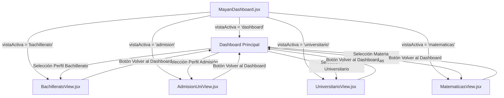
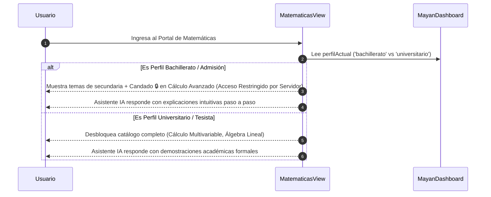

# 🏛️ Documento Técnico de Arquitectura: MAYAN TECH IA

> **Versión**: 0.1.0 (Producción Local)  
> **Plataforma**: MAYAN TECH IA — Powered by Pegassus IA  
> **Propósito**: Especificación técnica y mapa de componentes listo para análisis por modelos de IA (Z, DeepSeek, Gemini, GPT) y equipos de desarrollo.

---

## 📌 1. Visión General del Proyecto

**MAYAN TECH IA** es un sistema educativo adaptativo e interactivo basado en **React 18** y **Vite 6**. Su objetivo es proporcionar una experiencia de aprendizaje personalizada según el nivel del estudiante (Bachillerato, Admisión Universitaria, Universitario y Tesista), integrando asistentes de IA en tiempo real y comunicación mediante sockets.

### 🛠️ Tech Stack Principal:
- **Frontend Core**: React 18 (Hooks, State Management local y Router dinámico).
- **Build Tool**: Vite 6 (Compilación ultra rápida y HMR).
- **Estilos & UI**: Vanilla CSS Tailwind con tokens inspirados en la paleta Maya (`#065f46`, `#fbbf24`, `#101815`), Lucide React Icons y Tailwind CSS.
- **Notificaciones & Efectos**: `sonner` (Toast notifications) y `canvas-confetti` (Animaciones de logro).
- **Conectividad Backend**: WebSocket personalizado (`useThesisSocket`) para sincronización con la plataforma hermana *Tesis & Tutorías*.

---

## 📁 2. Estructura de Archivos y Carpetas

```files
MayaTiqIA/
├── index.html                  # Plantilla principal HTML5 con soporte de clase .dark
├── package.json                # Configuración de dependencias y scripts de producción
├── vite.config.js              # Configuración de Vite y JSX Transform
├── tailwind.config.js          # Paleta de colores personalizada y extensiones CSS
├── postcss.config.js           # PostCSS con Tailwind y Autoprefixer
├── myan-theme.css              # Estilos globales, temas claro/oscuro y utilidades
│
├── MayanDashboard.jsx          # 🎛️ Orquestador principal, Header global y Router de Vistas
│
├── 📄 Vistas Conectadas Especializadas:
│   ├── BachilleratoView.jsx    # 🎓 Portal Educación Media (PAA, materias núcleo, orientador vocacional IA)
│   ├── AdmisionUniView.jsx     # 📝 Portal Admisión Universitaria (Simulacro PAA cronometrado + diagnóstico IA)
│   ├── UniversitarioView.jsx   # 🧑‍🎓 Portal Educación Superior (Créditos, Socket Tesis, Cita APA 7 IA)
│   └── MatematicasView.jsx     # 🧮 Portal Adaptativo de Matemáticas (Resolutor IA + Acceso Restringido 🔒)
│
├── 🧩 Componentes del Dashboard Base:
│   ├── PerfilSelector.jsx      # Selector de perfil del usuario con acceso rápido a Portales Dedicados
│   ├── MateriasGrid.jsx        # Cuadrícula interactiva de materias disponibles
│   ├── ModosUso.jsx            # Botones de acción (Diagnóstico, Continuar, Logros, Progreso)
│   ├── ProgresoReciente.jsx    # Barras de avance y nivel por asignatura
│   ├── IntegracionTesis.jsx    # Tarjeta de sincronización WebSocket con Tesis
│   └── Skeleton.jsx            # Componente de carga visual (Shimmer effect)
│
└── 🔌 Hooks y Servicios:
    ├── hooks/useThesisSocket.js     # Hook para conexión en tiempo real vía WebSocket
    └── src/main.jsx                 # Punto de entrada de renderizado React DOM
```

---

## 🧭 3. Diagrama de Navegación y Flujo de Datos

El componente principal [`MayanDashboard.jsx`](file:///c:/Users/Alvaro/MayaTiqIA/MayanDashboard.jsx) gestiona un enrutador interno basado en el estado `vistaActiva`:



---

## 🔒 4. Arquitectura de Acceso Adaptativo (`MatematicasView.jsx`)

El módulo de **Matemáticas** utiliza una arquitectura de **Componente Único Adaptativo** respaldado por control de acceso de roles (RBAC):



---

## 📑 5. Detalle de Responsabilidades por Componente

### 1. `MayanDashboard.jsx` (Contred/Root Manager)
- Mantiene los estados compartidos: `perfilActual`, `materiaSeleccionada`, `vistaActiva`, `isDark`, `modoOnline`.
- Garantiza la persistencia del tema oscuro/claro en `localStorage` (`mayan_tema`).
- Sincroniza la clase CSS `.dark` en el tag `<html>` de la aplicación.

### 2. `BachilleratoView.jsx` (Educación Media)
- Muestra asignaturas base: Matemáticas Bachillerato, Física, Química, Lenguaje y Biología.
- Incorpora un simulador preliminar de Admisión Universitaria (PAA).
- Incluye el módulo de **Orientación Vocacional asistido por IA**.

### 3. `AdmisionUniView.jsx` (Simulacro & Diagnóstico)
- Cobertura de las áreas evaluadas en la PAA: Razonamiento Matemático (40%), Razonamiento Verbal (40%) y Redacción (20%).
- **Simulacro Cronometrado**: Temporizador activo, cálculo automático de puntaje (800 - 1600 pts) y retroalimentación explicativa.
- **Diagnóstico Estratégico IA**: Genera recomendaciones de estudio basadas en aciertos y errores.

### 4. `UniversitarioView.jsx` (Educación Superior)
- Panel de métricas: Créditos acumulados (UMA), Promedio ponderado (GPA) y estado del protocolo de tesis.
- Asignaturas de nivel superior: Cálculo Multivariable, Estadística Inferencial, Metodología de la Investigación.
- **Integración Socket**: Notificación en tiempo real del progreso de tesis al tutor asignado.
- **Generador APA 7 IA**: Asistente para estructurar citas académicas según la 7ma edición.

### 5. `MatematicasView.jsx` (Portal Adaptativo)
- Motor unificado de lecciones interactiva.
- Resolutor de Fórmulas IA con generación de pasos interactiva.
- Desafío diario con ganancias de experiencia (+20 XP), racha de estudio y animaciones de confeti.

---

## 📦 6. Archivo de Dependencias (`package.json`)

```json
{
  "name": "mayan-tech-ia",
  "private": true,
  "version": "0.1.0",
  "type": "module",
  "scripts": {
    "dev": "vite",
    "build": "vite build",
    "preview": "vite preview"
  },
  "dependencies": {
    "canvas-confetti": "^1.9.4",
    "lucide-react": "^0.475.0",
    "react": "^18.3.1",
    "react-dom": "^18.3.1",
    "sonner": "^2.0.1"
  },
  "devDependencies": {
    "@types/canvas-confetti": "^1.9.0",
    "@types/react": "^18.3.18",
    "@types/react-dom": "^18.3.5",
    "@vitejs/plugin-react": "^4.3.4",
    "autoprefixer": "^10.4.20",
    "postcss": "^8.5.2",
    "tailwindcss": "^3.4.17",
    "vite": "^6.1.0"
  }
}
```

---

## 💬 7. Prompt Recomendado para Compartir con IA (Z, DeepSeek, Gemini, GPT)

```text
"Tengo el siguiente proyecto React + Vite llamado MAYAN TECH IA con 4 portales principales (Bachillerato, Admisión Universitaria, Universitario y Matemáticas Adaptativa). 
Analiza la estructura técnica descrita en el documento adjunto y sugiéreme:
1. Cómo estructurar las rutas con React Router v6 en lugar del estado local vistaActiva.
2. Cómo implementar un backend en Python (FastAPI) o Node.js que procese las solicitudes del Resolutor de Fórmulas IA y gestione la autenticación JWT con control de acceso por roles (RBAC)."
```
